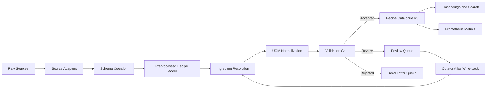
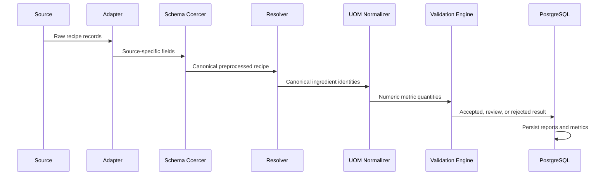

# ShopConnect Recipe Intelligence Platform

## Title Page

**Project Title:** ShopConnect Recipe Intelligence Platform  
**Project Type:** Production-grade data engineering and recipe intelligence pipeline  
**Domain:** Food technology, recipe data ingestion, ingredient normalization, validation, search, and enrichment  
**Repository:** `Dishitha09/recipe-intelligence-platform`  
**Database:** PostgreSQL with pgvector  
**Report Date:** 22 July 2026  

---

## Abstract

The ShopConnect Recipe Intelligence Platform is a production-oriented data pipeline for collecting, normalizing, enriching, validating, and storing Indian recipe data from multiple source types. The platform addresses the key problem of transforming heterogeneous raw recipe data into a reliable catalogue suitable for search, grocery intelligence, recipe recommendations, and downstream AI/RAG use cases.

The implemented system supports ingestion from web pages, structured datasets, YouTube transcript sidecars, PDF/cookbook sidecars, audio transcript sidecars, image/OCR sidecars, plain text, and CSV/manual uploads. It normalizes all records into a canonical schema, resolves ingredients against a master ingredient catalogue, harmonizes household units into numeric metric values, validates records through an 11-check gate, persists accepted/review/rejected outcomes, and exposes operational metrics through Prometheus.

The final v3 catalogue contains **6,571 recipes**, all with ingredients and cooking steps. The ingredient resolution rate is **98.85%**, exceeding the required **94%** target. The validation acceptance rate is **92.19%**, exceeding the required **85%** target, with **0 critical failures in accepted records**. The implementation is backed by automated tests, database integration checks, Docker Compose deployment proof, scheduled pipeline execution support, and curator alias write-back evidence.

---

## Problem Statement

Recipe data from real-world sources is inconsistent, incomplete, and difficult to use directly in production. Different sources expose different field names, measurement formats, ingredient spellings, regional labels, instruction formats, and metadata quality. A production recipe intelligence system must therefore solve more than basic scraping.

The platform must:

- Ingest recipe data from multiple source types.
- Normalize heterogeneous fields into a canonical recipe model.
- Preserve unmapped source information without silently dropping data.
- Resolve raw ingredient names to canonical ingredients.
- Normalize household and colloquial units into metric quantities.
- Validate records before they enter the master catalogue.
- Route low-quality records to review or dead-letter storage.
- Prevent duplicates on reruns.
- Track ingestion runs and operational quality metrics.
- Support production deployment, backup/export, monitoring, and curator correction workflows.

---

## Objectives

The main objectives of the project are:

1. Build a modular multi-source ingestion system for Indian recipes.
2. Implement schema coercion for heterogeneous raw source formats.
3. Resolve ingredients using alias lookup, vector search support, and LLM escalation hooks.
4. Normalize units of measure into a canonical metric-friendly set.
5. Implement a validation gate with clear accept/review/reject routing.
6. Store production data in PostgreSQL with a rich v3 catalogue schema.
7. Persist validation reports, review queue records, dead-letter rows, and ingredient resolution reports.
8. Provide measurable production KPIs for validation and ingredient resolution.
9. Add deployment proof using Docker Compose.
10. Add Prometheus metrics, alert hooks, backup/export scripts, and scheduled pipeline proof.
11. Add curator alias write-back so manual corrections improve future resolution.

---

## System Design / Architecture

The system is organized as a staged data pipeline. Each stage performs a specific production responsibility and passes structured data to the next stage.



### Pipeline Workflow



### Runtime Deployment

The runtime stack uses Docker Compose with:

- FastAPI service
- PostgreSQL with pgvector
- Prometheus

The current monitoring layer intentionally uses Prometheus metrics and API health endpoints only. No dashboard UI is included in the final stack.

---

## Technology Stack

| Layer | Technology |
|---|---|
| Language | Python |
| API | FastAPI, Uvicorn |
| Database | PostgreSQL |
| Vector Search | pgvector |
| ORM/DB Access | SQLAlchemy, psycopg2 |
| Validation | Pydantic models, custom validation engine |
| Scraping | Scrapy, requests, BeautifulSoup |
| Data Processing | pandas, custom parsers |
| Embeddings | sentence-transformers, pgvector storage |
| LLM Hook | Gemini Flash-compatible resolver interface |
| Observability | Prometheus metrics endpoint |
| Reliability | tenacity retry utilities |
| Deployment | Docker, Docker Compose |
| Testing | pytest |

---

## Implementation Details

### PS-1: Multi-Source Ingestion

The platform supports the required source adapter pattern. Implemented source coverage includes:

- Web pages
- Structured datasets
- YouTube transcript sidecars
- PDF/cookbook sidecars
- Audio transcript sidecars
- Image/OCR sidecars
- Plain text
- CSV/manual upload

Evidence file:

```text
evidence/catalogue_v3_multisource_evidence_latest.json
```

Final source type counts:

| Source Type | Recipe Count |
|---|---:|
| Web | 4,817 |
| Dataset | 1,747 |
| CSV/manual | 2 |
| YouTube transcript | 1 |
| PDF/cookbook | 1 |
| Audio transcript | 1 |
| Image/OCR | 1 |
| Plain text | 1 |

### PS-2: Schema Coercion

Schema coercion maps raw records into a canonical recipe structure. The implementation uses source-specific field mappings and preserves unmapped fields in metadata. This prevents silent data loss and protects downstream stages from missing-key crashes.

Key behavior:

- Converts source-specific field names into canonical fields.
- Applies defaults where appropriate.
- Preserves unmapped fields in metadata.
- Validates output against central schema definitions.
- Routes invalid records away from the master catalogue.

### PS-3: Ingredient Resolution

Ingredient resolution uses a tiered design:

1. Exact alias match against the master ingredient catalogue.
2. Vector similarity search using pgvector-backed embeddings.
3. LLM escalation hook for unresolved cases.

The latest v3 KPI proof shows:

| Metric | Value |
|---|---:|
| Ingredient rows | 83,731 |
| Resolved rows | 82,764 |
| Unresolved rows | 967 |
| Resolution rate | 98.85% |
| Required rate | 94% |
| Embedding coverage | 100% |

### PS-4: UOM Normalization

The UOM normalization layer parses recipe measurements and converts them into a canonical numeric format.

Supported canonical units:

```text
g, ml, tsp, tbsp, cup, count
```

For final catalogue storage, household quantities are enriched with canonical metric representations such as:

```json
{
  "raw_text": "3/4 cup red onion (chopped)",
  "name": "red onion",
  "quantity": 0.75,
  "unit": "cup",
  "canonical_quantity": 120,
  "canonical_unit": "g",
  "normalized_text": "120 g red onion",
  "conversion_method": "density_lookup"
}
```

Numeric quality report:

| Metric | Value |
|---|---:|
| String quantity rows | 0 |
| String canonical quantity rows | 0 |
| Long decimal quantity rows | 0 |
| Non-metric canonical unit rows | 0 |
| Quantity-prefixed name rows | 0 |

### PS-5: Validation Gate

The validation gate applies 11 checks across severity levels.

| Severity | Examples | Action |
|---|---|---|
| Critical | Schema completeness, step count, ingredient count, duplicate guard | Reject |
| High | Quantity sanity, allergen consistency, UOM conflict | Review |
| Medium | Nutrition plausibility, enrichment confidence, language consistency | Flag |
| Low | Image availability | Warn |

Final validation KPI:

| Metric | Value |
|---|---:|
| Validated recipes | 6,571 |
| Accepted | 6,058 |
| Review | 504 |
| Rejected | 9 |
| Acceptance rate | 92.19% |
| Required acceptance | 85% |
| Accepted critical failures | 0 |

---

## Database Design

The project uses PostgreSQL with two major logical layers:

1. Operational tables for ingestion, validation, review, dead-letter, and embeddings.
2. `recipe_catalogue_v3`, the rich final catalogue table.

### Main v3 Catalogue Table

Important columns include:

| Column | Purpose |
|---|---|
| `recipe_id` | UUID primary key |
| `name` | Recipe name |
| `description` | Recipe description |
| `metadata` | Source URL, content hash, provenance |
| `servings` | Serving count for scaling |
| `ingredients_json` | Structured ingredients |
| `prep_steps` | Prep steps |
| `cook_steps` | Cooking instructions |
| `quick_steps` | Condensed instruction list |
| `course`, `region`, `diet`, `cuisines` | Classification fields |
| `nutrition_info` | Source-provided nutrition where available |
| `source` | Source identifier |
| `language` | Content language |
| `created_at`, `updated_at` | Audit timestamps |

### Operational Tables

| Table | Purpose |
|---|---|
| `ingestion_runs` | Tracks source runs, status, counts, and errors |
| `validation_reports` | Stores PS-5 validation output |
| `review_queue` | Stores records needing human review |
| `dead_letter_queue` | Stores rejected records and failure reasons |
| `master_ingredients` | Canonical ingredient catalogue |
| `ingredient_aliases` | Alias lookup table |
| `ingredient_resolution_reports` | Per-ingredient resolution evidence |
| `ingredient_embeddings` | pgvector ingredient embeddings |
| `recipe_embeddings` | pgvector recipe embeddings |

### Idempotency

Duplicate prevention is implemented using:

- `metadata->>'source_url'`
- `metadata->>'content_hash'`
- stable report hashes for validation, review, dead-letter, and resolution reports

---

## AI/ML Approach

The AI/ML component focuses on semantic ingredient and recipe understanding.

### Embeddings

The system uses sentence embeddings to support vector similarity search. Embeddings are stored in pgvector-backed tables. HNSW indexes are created where supported by the database extension.

Embedding proof:

| Metric | Value |
|---|---:|
| Master ingredients | 18,207 |
| Ingredient embeddings | 18,207 |
| Embedding coverage | 100% |

### LLM Resolver Hook

The system includes a Tier 3 LLM resolver interface for Gemini Flash-style escalation. It is designed to run only when exact alias and vector similarity resolution fail. The resolver is cost-gated so LLM usage remains controlled.

In the latest KPI report, no LLM escalation was needed because alias coverage already resolved the target threshold:

```text
llm_escalation_rate = 0.0
```

### Curator Feedback Loop

The curator workflow allows manual correction of unresolved ingredient names. Corrections are written back to the alias table so the next run resolves the same raw string through Tier 1 exact alias matching.

Curator proof:

| Metric | Value |
|---|---:|
| Before unresolved mentions | 1,611 |
| After unresolved mentions | 951 |
| Catalogue rows updated | 645 |
| Workflow passed | true |

---

## Results and Observations

### Final Production KPI Summary

| Metric | Result |
|---|---:|
| Recipes in v3 catalogue | 6,571 |
| Recipes with ingredients | 6,571 |
| Recipes with steps | 6,571 |
| Ingredient rows | 83,731 |
| Master ingredients | 18,207 |
| Ingredient aliases | 1,197 |
| Ingredient embeddings | 18,207 |
| Ingredient resolution rate | 98.85% |
| Validation acceptance rate | 92.19% |
| Accepted critical failures | 0 |
| Test suite | 143 passed |

### Sample API Outputs

Health endpoint:

```json
{
  "status": "ok",
  "service": "recipe-intelligence-api",
  "checked_at": "2026-07-21T04:51:16.964094+00:00"
}
```

Readiness endpoint:

```json
{
  "status": "ready",
  "checks": {
    "operational_db": "ok",
    "catalogue_v3_db": "ok"
  }
}
```

Prometheus metric examples:

```text
records_ingested_total
ingredient_resolution_rate
validation_acceptance_rate
dead_letter_rate
pipeline_e2e_latency_p99
llm_calls_per_batch
```

### Scheduled Pipeline Proof

The Windows scheduled task was registered:

```text
ShopConnect Catalogue V3 Pipeline
```

The task completed successfully with:

```text
LastTaskResult = 0
```

The scheduled proof run generated:

```text
evidence/scheduled_catalogue_v3_run_latest.json
```

---

## Challenges Faced

### 1. Heterogeneous Source Formats

Different recipe sources expose ingredients, timings, nutrition, and instructions in different ways. The schema coercion layer was required to prevent source-specific logic from leaking into the core pipeline.

### 2. Ingredient Name Variability

Indian recipe ingredients have many spellings, aliases, transliterations, and compound forms. This required alias lookup, normalization, curator write-back, and embedding support.

### 3. Unit Normalization

Recipes use cups, teaspoons, tablespoons, pinches, handfuls, counts, grams, milliliters, and vague phrases. The UOM normalizer had to preserve the raw measurement while also producing numeric canonical quantities.

### 4. Validation Strictness

The validation gate initially sent many rows to review because UOM conflicts were too strict for ingredients without exact density values. The final implementation flags estimated density conversions instead of unnecessarily rejecting usable records.

### 5. Docker Fresh Setup

Docker proof exposed practical production issues:

- Docker Desktop had to be running.
- `.pytest_cache` needed to be excluded through `.dockerignore`.
- Host API port `8000` was already allocated, so Compose now uses `8001`.
- Schema migrations required idempotency hardening for repeated bootstrap.

### 6. Scheduled Automation Runtime

A broad scheduled crawl can run longer than expected. The proof task was changed to a bounded source run so scheduled execution can be demonstrated reliably.

---

## Future Enhancements

1. Increase the number of production-quality recipes if future requirements demand a larger catalogue.
2. Expand real non-web source volumes beyond proof records.
3. Add a lightweight curator UI for review queue corrections.
4. Add authenticated admin APIs for review workflow operations.
5. Add more ingredient aliases from reviewer feedback.
6. Improve nutrition extraction coverage from web sources.
7. Add source-specific quality scoring.
8. Add more regional/state-level balancing logic.
9. Add richer operational visualization only if future stakeholders request it.
10. Add CI/CD deployment automation for cloud hosting.

---

## Conclusion

The ShopConnect Recipe Intelligence Platform now satisfies the core production-grade requirements of the problem statement. It provides multi-source ingestion, schema coercion, ingredient resolution, UOM normalization, validation routing, operational persistence, pgvector-backed embeddings, Prometheus metrics, scheduled execution proof, Docker deployment proof, and curator alias write-back.

The final results exceed the required quality thresholds: ingredient resolution is **98.85%** against a **94%** requirement, validation acceptance is **92.19%** against an **85%** requirement, and accepted critical failures are **0**. The database contains **6,571** structured Indian recipes, all with ingredients and cooking steps. The project is therefore review-ready as a production-grade recipe data pipeline.

---

## References

1. PostgreSQL Documentation: https://www.postgresql.org/docs/
2. pgvector Documentation: https://github.com/pgvector/pgvector
3. FastAPI Documentation: https://fastapi.tiangolo.com/
4. SQLAlchemy Documentation: https://docs.sqlalchemy.org/
5. Scrapy Documentation: https://docs.scrapy.org/
6. Prometheus Documentation: https://prometheus.io/docs/
7. Docker Documentation: https://docs.docker.com/
8. Pydantic Documentation: https://docs.pydantic.dev/
9. sentence-transformers Documentation: https://www.sbert.net/

---

## Appendix

### Appendix A: Important Files

| File | Purpose |
|---|---|
| `docker-compose.yml` | Runtime stack |
| `Dockerfile` | API image build |
| `services/api/main.py` | FastAPI endpoints |
| `services/preprocessing/schema_coercer.py` | Schema coercion |
| `services/enrichment/ingredient_resolution/ingredient_resolver.py` | Ingredient resolution |
| `services/enrichment/uom/uom_normalizer.py` | UOM normalization |
| `services/validation/validation_engine.py` | Validation gate |
| `db/catalogue_v3/01_create_recipe_catalogue_v3.sql` | v3 catalogue schema |
| `db/catalogue_v3/03_operational_tables.sql` | v3 operational tables |
| `scripts/catalogue_v3_production_kpi_report.py` | Final KPI proof |
| `scripts/run_catalogue_v3_scheduled_job.py` | Scheduled automation |
| `scripts/backup_catalogue_v3.py` | Backup/export process |

### Appendix B: Evidence Files

| Evidence File | Purpose |
|---|---|
| `evidence/deployment_verification_20260721.md` | Docker and runtime proof |
| `evidence/scheduled_catalogue_v3_run_latest.json` | Scheduled run proof |
| `evidence/catalogue_v3_multisource_evidence_latest.json` | Multi-source coverage proof |
| `evidence/catalogue_v3_curator_workflow_latest.json` | Curator write-back proof |

### Appendix C: Useful Commands

Run tests:

```bash
python -m pytest
```

Run final KPI report:

```bash
python -m scripts.catalogue_v3_production_kpi_report
```

Run numeric ingredient quality report:

```bash
python -m scripts.report_catalogue_v3_ingredient_numeric_quality
```

Start runtime stack:

```bash
docker compose up -d
```

Check API:

```bash
curl http://localhost:8001/health
curl http://localhost:8001/ready
curl http://localhost:8001/metrics
```

Run backup dry-run:

```bash
python -m scripts.backup_catalogue_v3 --dry-run
```
